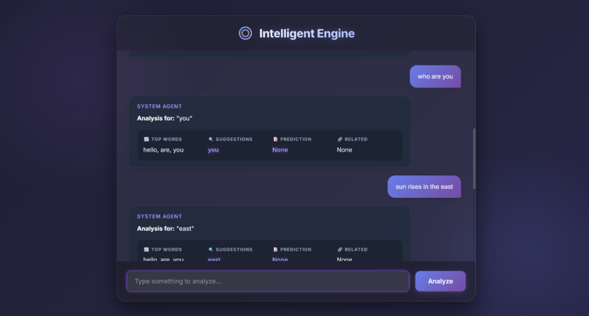

# Intelligent Text Engine




A sophisticated, learning-based conversational agent built from scratch using advanced data structures and graph algorithms. This project demonstrates how to implement an "intelligent" text processor without relying on large pre-trained language models (LLMs), instead using fundamental computer science concepts.


[](https://intelligent-text-engine.vercel.app/)

### 🔴 [Chat with the Agent Live](https://intelligent-text-engine.vercel.app/)

## 🧠 Core Intelligence

The core of this engine (`intelligent_text_engine.py`) is powered by a hybrid combination of custom data structures:

*   **Red-Black Tree**: Used for balanced, efficient storage and retrieval of known words.
*   **Trie (Prefix Tree)**: Powers the real-time **Auto-completion** suggestions.
*   **Bigram Model**: Provides **Next Word Prediction** based on probability frequencies observed in the conversation history.
*   **Directed Graph (NetworkX)**: Maps and visualizes complex **Word Relationships** (predecessor/successor links).

## ✨ Features

*   **Interactive Chat Interface**: A premium, glassmorphism-styled web UI for chatting with the agent.
*   **Real-time Analysis**: Every message you type is analyzed instantly.
*   **Dynamic Learning**: The engine starts fresh and learns vocabulary and sentence structures *as you chat with it*.
*   **Visual Stats HUD**:
    *   📈 **Top Words**: Most frequently used vocabulary.
    *   🔍 **Suggestions**: Auto-complete suggestions for the last word.
    *   📝 **Prediction**: Probabilistic likely next word.
    *   🔗 **Related**: Contextually linked words from the graph.

## 🛠️ Tech Stack

*   **Backend**: Python, Flask
*   **Data Structures**: NetworkX (Graphs), Custom Classes (Trie, RB Tree)
*   **Frontend**: HTML5, Vanilla JavaScript
*   **Styling**: CSS3 (Modern Glassmorphism, Animations)

## 🚀 Getting Started

Follow these instructions to get the project up and running on your local machine.

### Prerequisites

*   Python 3.8 or higher
*   pip (Python package installer)

### Installation

1.  **Clone the repository**
    ```bash
    git clone https://github.com/prakyath006/intelligent-text-engine.git
    cd intelligent-text-engine
    ```

2.  **Install Dependencies**
    ```bash
    pip install flask networkx
    ```

### 🏃‍♂️ Running the Agent

1.  **Start the Flask Server**
    ```bash
    python app.py
    ```

2.  **Access the Interface**
    Open your web browser and navigate to:
    ```
    http://127.0.0.1:5000
    ```

3.  **Chat!**
    Start typing sentences. You will see the agent analyze your input and update its internal models in real-time.

## 📂 Project Structure

```
intelligent-text-engine/
│
├── intelligent_text_engine.py  # Core logic (Trie, RB Tree, Graphs)
├── app.py                      # Flask server entry point
├── templates/
│   └── index.html              # Main chat interface
├── static/
│   ├── style.css               # Glassmorphism styling
│   └── script.js               # Frontend chat logic
└── README.md                   # Documentation
```

## 🤝 Contributing

Contributions are welcome! Feel free to submit a Pull Request.

1.  Fork the Project
2.  Create your Feature Branch (`git checkout -b feature/AmazingFeature`)
3.  Commit your Changes (`git commit -m 'Add some AmazingFeature'`)
4.  Push to the Branch (`git push origin feature/AmazingFeature`)
5.  Open a Pull Request

## 📄 License

Distributed under the MIT License. See `LICENSE` for more information.
